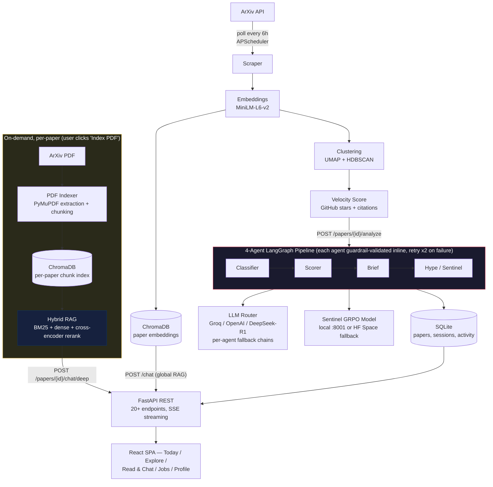
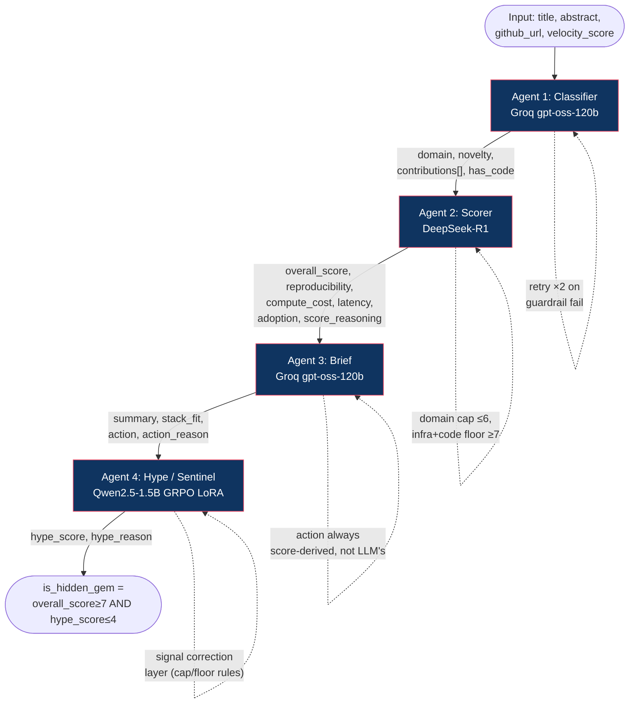
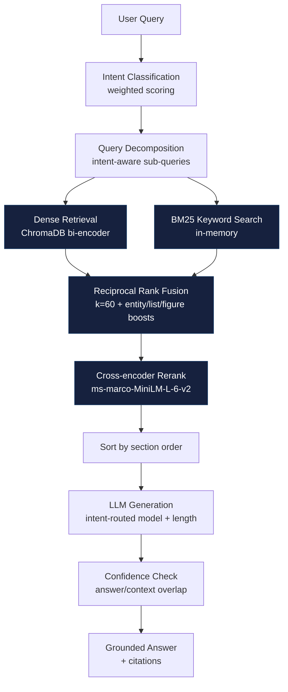
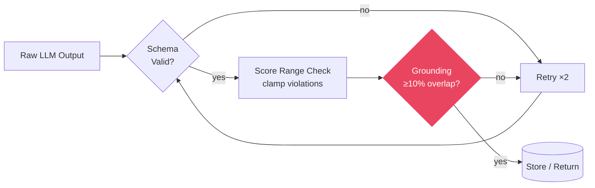
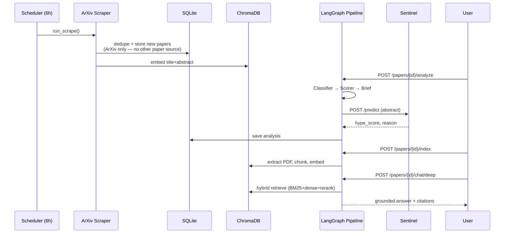

# Paper2Signal — Architecture Diagrams

Source diagrams for Paper2Signal, in Mermaid. GitHub renders Mermaid natively in `.md` files — view this file directly on GitHub for rendered diagrams, or paste any block into [mermaid.live](https://mermaid.live) to export as PNG/SVG for a polished version.

---

## 1. System Overview



**Note on guardrails:** validation (schema / score-range / grounding checks) happens *inside* each pipeline agent, immediately after that agent's LLM call — not as one shared gate after all four agents finish. See §5 for the per-agent guardrail flow.

**Note on the PDF/RAG branch:** unlike the ingestion pipeline (which runs automatically on a 6h schedule for every new paper), PDF indexing and hybrid RAG only run when a user explicitly opens a paper in Read & Chat and clicks "Index PDF" — it is not part of the automatic scrape → score flow.

---

## 2. The 4-Agent Pipeline (LangGraph StateGraph)



**Exact `PaperState` fields (TypedDict, `agents/pipeline.py`)** — every agent reads what it needs and writes only its own keys into this one shared object:

```python
class PaperState(TypedDict):
    # Input (set before the graph runs)
    paper_id: str
    title: str
    abstract: str
    github_url: str
    velocity_score: float

    # Agent 1 — Classifier
    domain: Optional[str]            # RAG | Fine-tuning | Reasoning | Vision | ... | Other
    novelty: Optional[str]           # incremental | moderate | significant | breakthrough
    contributions: Optional[list]    # 3 short strings
    has_code: Optional[bool]

    # Agent 2 — Scorer
    overall_score: Optional[float]       # 0-10, domain-capped / infra-floored
    reproducibility: Optional[float]     # 0-10
    compute_cost: Optional[float]        # 0-10
    latency: Optional[float]             # 0-10
    adoption: Optional[float]            # 0-10
    score_reasoning: Optional[str]

    # Agent 3 — Brief
    summary: Optional[str]
    stack_fit: Optional[str]         # free text, e.g. "PyTorch/HF/vLLM"
    action: Optional[str]            # Skip | Experiment | Strong Experiment | Adopt
    action_reason: Optional[str]     # always derived from overall_score, never from the LLM directly

    # Agent 4 — Hype / Sentinel
    hype_score: Optional[float]      # 1-10, or None if Sentinel unreachable — never guessed
    hype_reason: Optional[str]

    # Accumulated across all agents
    errors: list                     # e.g. "classifier_failed", "hype_failed"
```

**Key property:** each agent writes only its own fields to this shared typed state. A failure in one agent does not corrupt the others' output — guardrail failures are caught, retried twice, and degrade gracefully (e.g. the hype agent leaves `hype_score = None` rather than guessing, and appends to `errors` rather than raising).

---

## 3. Hybrid RAG Retrieval Pipeline



---

## 4. Guardrails Flow



---

## 5. Data Flow — End to End



**Source-of-truth correction:** papers are ingested from **ArXiv only** (`ingestion/scraper.py`). GitHub is used later, separately, only to fetch star counts for velocity scoring (`ml/velocity.py`) — it is not a paper source. HuggingFace is used as an LLM/model provider (DeepSeek-R1 routing, Sentinel hosting) — it is also not a paper source. A diagram that lists "arXiv / HF / GitHub" as parallel ingestion sources overstates the system; there is exactly one ingestion source.

---

## Notes for redrawing

- Color scheme used above: dark navy (`#0f3460`, `#16213e`) for infra/pipeline stages, red-pink (`#e94560`) for guardrail/decision points, white text throughout.
- The 4-agent pipeline (§2) is the diagram most worth polishing first — it maps directly to "LangGraph / LangChain, agents and tool-use" in a job description.
- The hybrid RAG diagram (§3) maps directly to "vector DBs, RAG pipelines."
- §5 (this one) overlaps substantially with §1's automatic-vs-on-demand story — consider whether it earns its own page or whether §1 already covers it well enough. If keeping it, avoid restating the same fact (e.g. "runs every 6h") in more than one place in the same image — swimlane diagrams get noisy fast, so redundant labels cost more here than in a simple flowchart.
