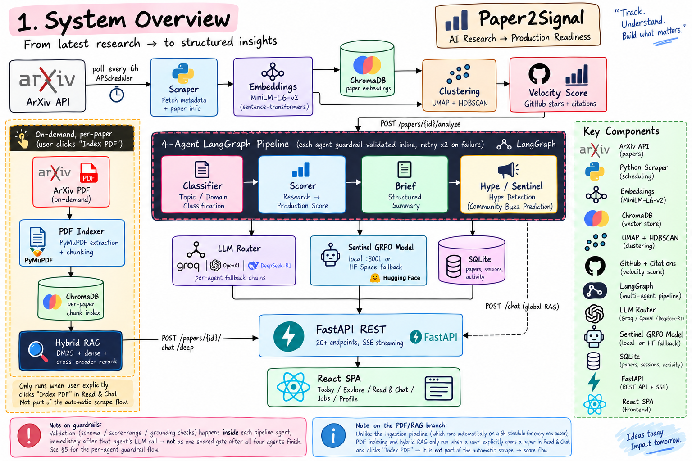
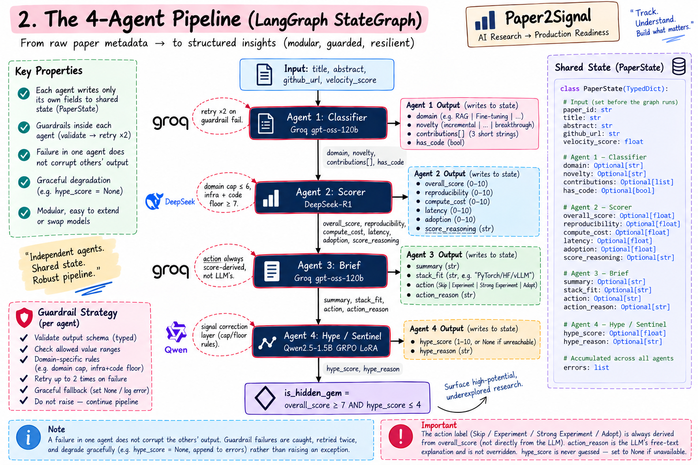
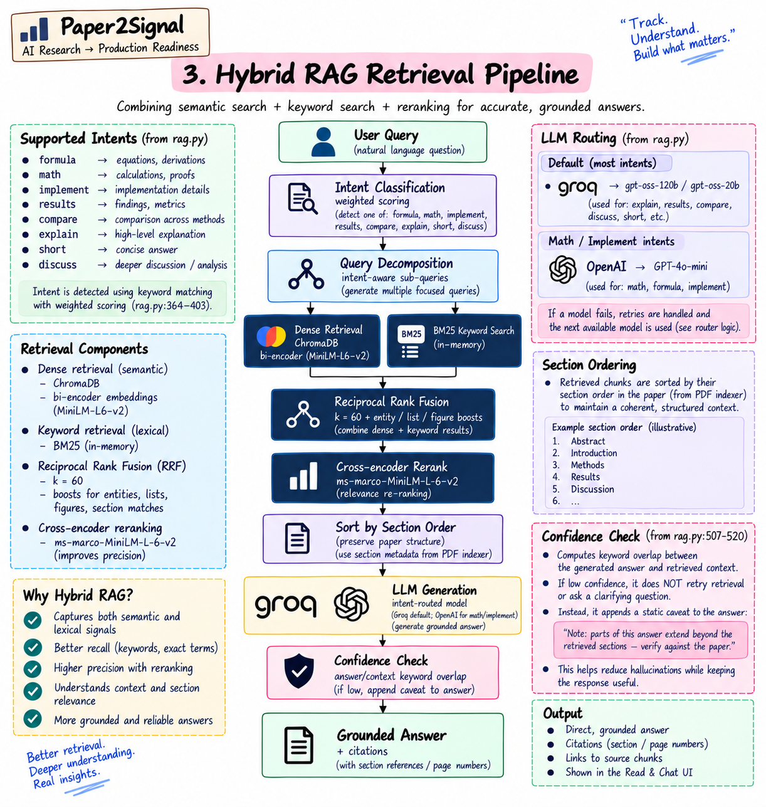
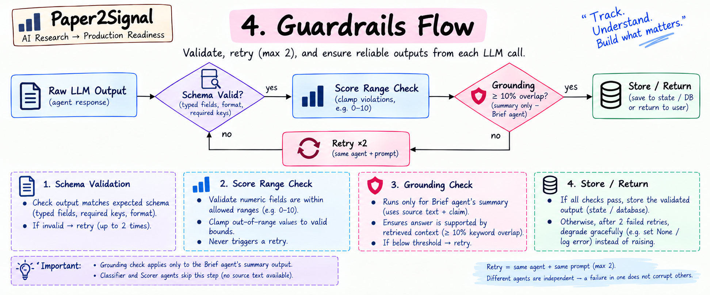
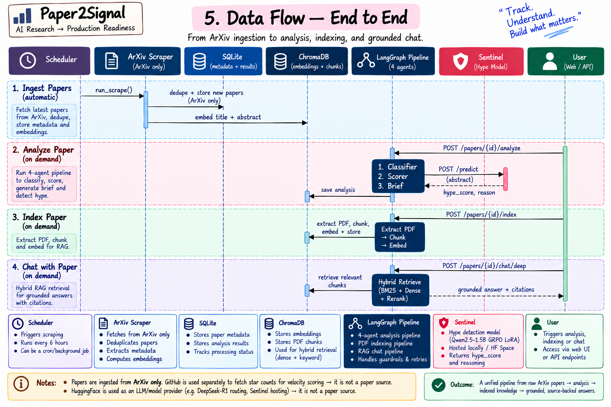

# Paper2Signal

**Production readiness radar for AI research papers.**
A multi-agent system that ingests ArXiv papers, scores them for engineering utility, predicts community hype using a GRPO fine-tuned model, and surfaces hidden gems — papers worth building with that nobody is talking about yet.


---

## What It Does

Most AI researchers consume papers passively. Engineers need to know: *can I ship this?* Paper2Signal answers that question automatically for every new ArXiv paper in your domain.

Given any ArXiv abstract, the system outputs:

| Signal | What it means |
|--------|--------------|
| **Production Score** (0–10) | How usable is this paper's method in an engineering stack today |
| **Action** | Skip / Experiment / Strong Experiment / Adopt |
| **Hype Score** (0–10) | Predicted community buzz — Twitter, GitHub, HuggingFace |
| **Hidden Gem** flag | High production score, low hype → worth implementing before the crowd |
| **Intelligence Brief** | 2-sentence summary + stack fit + reasoning |

---

## Why This Project

This is an agentic system, not a wrapper around a single prompt. Every design decision below exists because a naive version of it failed first:

- **A single LLM call can't do this job.** Asking one model to classify, score, write a brief, and predict hype in one shot produces generic, uncalibrated output. The task is decomposed into four agents, each with one responsibility, one model suited to that responsibility, and its own guardrails — a `LangGraph StateGraph`, not a chain of string concatenations.
- **LLMs default to hedging (5–6/10) when scoring is ambiguous.** Standard supervised fine-tuning of a hype model collapses to the mean for the same reason. Fixed with GRPO (reinforcement learning with relative rewards) instead of SFT — see [The Sentinel](#the-sentinel--grpo-fine-tuned-hype-detector) below.
- **Every LLM output is untrusted until validated.** Nothing generated is written to the database or shown to a user without passing schema validation, score-range checks, and a grounding/hallucination check first.
- **No single model provider is a dependency.** Every agent has a fallback chain (Groq → OpenAI, DeepSeek → Groq → OpenAI). The one exception is deliberate: the hype agent refuses to fall back to a generic LLM guess, because a wrong confident score is worse than an honest "unavailable."
- **Retrieval is hybrid because semantic search alone fails on exact terms.** Asking about a specific method name returns a smooth semantic near-miss unless it's combined with keyword (BM25) matching and reranked with a cross-encoder.

---

## System Architecture



<details>
<summary>ASCII fallback</summary>

```
┌──────────────────────────────────────────────────────────────────────────┐
│                              Paper2Signal                                │
│                                                                            │
│   ArXiv API                                                               │
│      │  (poll every 6h — APScheduler)                                    │
│      ▼                                                                    │
│   ┌────────────────────────────────────────────────────────────────┐     │
│   │  INGESTION LAYER                                                │     │
│   │  Scraper → Embeddings (MiniLM) → ChromaDB → Clustering →        │     │
│   │  Velocity Score (GitHub stars + citations)                      │     │
│   └───────────────────────────────┬────────────────────────────────┘     │
│                                    │                                       │
│                                    ▼                                       │
│                  ┌──────────────────────────────────┐                     │
│                  │   4-AGENT LANGGRAPH PIPELINE      │                     │
│                  │   Classifier → Scorer → Brief →   │                     │
│                  │   Hype  (each agent guardrailed)  │                     │
│                  └────────────────┬───────────────────┘                   │
│                                    │                                       │
│          ┌─────────────────────────┼──────────────────────┐              │
│          ▼                         ▼                       ▼              │
│  ┌───────────────┐        ┌────────────────┐      ┌─────────────────┐    │
│  │  LLM Router    │        │  Sentinel      │      │  PDF Indexer +   │    │
│  │  Groq/OpenAI/  │        │  GRPO model    │      │  Hybrid RAG      │    │
│  │  DeepSeek-R1   │        │  (local/HF)    │      │  (BM25+dense+    │    │
│  │  w/ fallback   │        │                │      │  cross-encoder)  │    │
│  └───────────────┘        └────────────────┘      └─────────────────┘    │
│          │                                                    │           │
│          └─────────────────────────┬──────────────────────────┘           │
│                                     ▼                                     │
│                          ┌──────────────────┐                             │
│                          │  Guardrails Layer │                             │
│                          │  Schema / Score /  │                             │
│                          │  Grounding checks  │                             │
│                          └────────┬───────────┘                            │
│                                    ▼                                      │
│                          ┌──────────────────┐                             │
│                          │   FastAPI REST    │                             │
│                          │   (20+ endpoints, │                             │
│                          │   SSE streaming)  │                             │
│                          └────────┬───────────┘                            │
│                                    ▼                                      │
│                          ┌──────────────────┐                             │
│                          │   React SPA (Vite)│                             │
│                          └──────────────────┘                             │
└──────────────────────────────────────────────────────────────────────────┘
```

Mermaid sources for every diagram in this README live in [`ARCHITECTURE.md`](ARCHITECTURE.md), alongside notes on what each one covers and where it maps to the codebase.

</details>

---

## The 4-Agent Pipeline

Every paper passes through a LangGraph `StateGraph` with four sequential agents. Each agent has a dedicated LLM, a specific role, and guardrails on its output. State is a single typed dict (`PaperState`) threaded through the graph — every agent reads only what it needs and writes only its own fields, so failures are isolated per agent rather than corrupting the whole run.



<details>
<summary>ASCII fallback</summary>

```
Abstract Input
      │
      ▼
┌─────────────────────────────────────────────────────────────────┐
│  Agent 1 — The Classifier                                        │
│  Model: Groq openai/gpt-oss-120b (fast, free tier)               │
│  Output: domain, novelty, contributions[], has_code               │
│  Guard: schema validation, retry ×2                               │
└──────────────────────────────┬──────────────────────────────────┘
                               │
                               ▼
┌─────────────────────────────────────────────────────────────────┐
│  Agent 2 — The Scorer (DeepSeek-R1)                               │
│  Model: DeepSeek-R1-Distill-Llama-8B via HF Router                 │
│  Output: overall_score, reproducibility, compute_cost,             │
│          latency, adoption, reasoning                              │
│  Corrections applied (deterministic calibration layer):            │
│    • Scale normalized scores (< 1.0 → ×10)                         │
│    • Domain cap: non-ML papers → ≤ 6.0                             │
│    • Infra+code floor: efficiency papers with code → ≥ 7.0         │
│  Fallback: Groq if DeepSeek unavailable                            │
└──────────────────────────────┬──────────────────────────────────┘
                               │
                               ▼
┌─────────────────────────────────────────────────────────────────┐
│  Agent 3 — The Scribe                                              │
│  Model: Groq openai/gpt-oss-120b                                   │
│  Output: summary, stack_fit, action, action_reason                 │
│  Note: action is ALWAYS overridden by a deterministic score rule   │
│    (never trust the LLM's own action label):                       │
│    score < 4 → Skip | < 6 → Experiment |                           │
│    < 8 → Strong Experiment | ≥ 8 → Adopt                           │
└──────────────────────────────┬──────────────────────────────────┘
                               │
                               ▼
┌─────────────────────────────────────────────────────────────────┐
│  Agent 4 — The Sentinel (GRPO Fine-tuned)                          │
│  Model: Qwen2.5-1.5B-Instruct + LoRA                                │
│         (shau1905/papersignal-hype-detector), local or HF fallback │
│  Output: hype_score (1–10), hype_reason                            │
│  Signal correction layer:                                           │
│    • theory + no code → cap ≤ 3                                    │
│    • no practical signals → cap ≤ 5                                │
│    • code + no infra → cap ≤ 6                                     │
│    • infra + code → floor ≥ 7                                      │
│  If Sentinel is unreachable → hype_score stays None.                │
│  Never silently substitutes a generic LLM guess.                   │
└──────────────────────────────┬──────────────────────────────────┘
                               │
                               ▼
              is_hidden_gem = score ≥ 7 AND hype ≤ 4
```

</details>

Every agent call is wrapped with retry (×2 on guardrail failure) and instrumented — see [Agent Observability](#agent-observability) below.

---

## The Sentinel — GRPO Fine-tuned Hype Detector

The hype model is the most technically novel component of the system. Standard LLMs cannot reliably score community hype because they default to mid-range outputs (5–6) for everything. This is solved with **Group Relative Policy Optimization (GRPO)** fine-tuning instead of supervised fine-tuning — SFT on a scalar hype label produces mid-range collapse because the model minimizes MSE loss by hedging. GRPO uses relative reward signals between candidate outputs, forcing the model to discriminate between HIGH and LOW.

### Training Setup

| Component | Detail |
|-----------|--------|
| Base model | `Qwen2.5-1.5B-Instruct` (Unsloth 4-bit) |
| Fine-tuning method | GRPO via TRL |
| LoRA rank | r=16, α=32 |
| Dataset | 303 papers (87 HIGH / 103 MED / 113 LOW) |
| Training steps | 230 (stopped at KL divergence peak) |
| Hosted | `shau1905/papersignal-hype-detector` |

### Reward Design

Two reward functions trained simultaneously:

```
Reward 1 — Score Accuracy (confidence-weighted)
  • Gaussian decay from ground truth score
  • Landmark papers (FlashAttention, LoRA, Transformers): full penalty ×2
  • GPT-labeled papers: softened ×0.7 (noisy labels)
  • Missed HIGH by landmark: ×2.0 penalty
  • Missed HIGH by GPT paper: ×1.5 penalty

Reward 2 — Grounding Check
  • Keyword overlap between reason and abstract
  • < 10% overlap → -1.0 (generic boilerplate)
  • > 40% overlap → +1.0 (grounded in paper)
  • Blocks: "LLMs, agents, multimodal, diffusion" boilerplate patterns → -1.0
```

### Training Dynamics

```
Steps 0–100:    Learning phase     (reward: -0.3 → +0.5)
Steps 100–150:  Improving          (reward: +0.5 → +0.8)
Steps 150–200:  Peak zone ★        (reward: 0.8–1.0, grounding: ~1.0)
Steps 200+:     Post-peak drift    (KL diverging, reward unstable)
                → Stopped at step 230
```

**Why stop at step 230?** KL divergence reached 0.35+ and grounding reward saturated at 1.0 — both strong indicators of reward exploitation beginning (keyword stuffing). The model at step 200 already had ≥90% of peak performance; continuing would trade reward-hacking risk for no real accuracy gain.

### Test Results

| Paper Type | Expected | Got | Result |
|-----------|----------|-----|--------|
| LoRA (landmark) | 7–9 | 8.0 | ✅ |
| FlashAttention (infra) | 7–9 | 9.0 | ✅ |
| New paper, simple+useful | 7–9 | 8.0 | ✅ |
| Theory, no code | 1–3 | 3.0 | ✅ |
| Over-hyped, no implementation | 2–5 | 2.0 | ✅ |
| DeepSeek-R1 style | 8–10 | 8.0 | ✅ |
| Mamba SSM | 7–9 | 9.0 | ✅ |
| Safety paper with code | 5–7 | 8.0 | ❌ |

**Even the calibrated model isn't perfect** — the one miss above (a safety paper with code scoring higher than expected) is a known failure mode: the correction layer floors "infra + code" combinations at 7+, which overrides nuance the base model may have had. This is the tradeoff of a deterministic calibration layer over a learned one — documented here rather than hidden.

---

## Ingestion & ML Pipeline

```
ArXiv API (6-hour poll)
        │
        ▼
   Scraper.py
   ┌───────────────────────────────────────┐
   │ • Fetch by category: cs.LG, cs.AI,    │
   │   cs.CL, cs.CV, stat.ML               │
   │ • Deduplicate by arxiv_id              │
   │ • Extract GitHub URLs via regex        │
   │ • Store to SQLite via SQLAlchemy       │
   └──────────────────┬────────────────────┘
                      │
                      ▼
            Embeddings.py
   ┌───────────────────────────────────────┐
   │ Model: all-MiniLM-L6-v2                │
   │ Input: title (×2) + abstract           │
   │ Batch: 32 papers                       │
   │ Store: ChromaDB (cosine space)          │
   │ Metadata: score, action, summary       │
   └──────────────────┬────────────────────┘
                      │
                      ▼
            Clustering.py
   ┌───────────────────────────────────────┐
   │ UMAP: 384-dim → 5-dim (cosine)          │
   │ HDBSCAN: min_cluster=3, eom method      │
   │ Theme labels: TF-IDF on titles          │
   │ Output: cluster_id, cluster_theme       │
   └──────────────────┬────────────────────┘
                      │
                      ▼
            Velocity.py
   ┌───────────────────────────────────────┐
   │ GitHub API: star count                  │
   │ Semantic Scholar: citation count        │
   │ velocity = 0.6×star_rate                │
   │           + 0.4×citation_rate           │
   └───────────────────────────────────────┘
```

---

## PDF Indexer & Hybrid RAG System

When a user clicks "Index PDF," the system builds a local, per-paper knowledge base. All retrieval is local — zero API cost per query.



<details>
<summary>ASCII fallback</summary>

### Index Build Pipeline

```
ArXiv PDF
    │
    ▼
PyMuPDF extraction
    ├── Text blocks (paragraph-aware, PyMuPDF native boundaries)
    │       • Noise filter: page numbers, artifacts, short stubs
    │       • Section header detection via regex
    │       • 50-word overlap between adjacent chunks (continuity)
    │       • Figure caption tagging (Fig. N, Table N)
    │       • Math detection ($, \frac, ∑, →)
    └── Table extraction (structured rows)

    ▼
Two storage layers per section
    ├── Paragraph chunks  → exact retrieval (specific facts)
    └── Section summaries → reasoning layer (overview questions)

    ▼
ChromaDB (separate collection per index version)
    • Embedding text: labeled  [Section | Page N | MATH]
    • LLM context text: clean  (no label artifacts — prevents context leakage)
    • Overlap context: raw_text_ctx  (50-word prefix)
```

### Retrieval Pipeline (per query)

```
User Query
    │
    ▼
Intent Classification (weighted scoring, not first-match regex)
    • formula / math / implement / results / compare / explain / short / discuss
    • Each pattern contributes a score; highest-scoring intent wins
    • Drives: chunk count, sub-query decomposition, response length, model choice
    │
    ▼
Query Decomposition (intent-aware)
    • "implement" intent → 4-6 sub-queries (architecture, forward pass,
    │   pseudocode, hyperparameters — implementation detail is scattered
    │   across Methods/Appendix, a single query rarely surfaces all of it)
    • "math" intent → derivation + objective-function sub-queries
    │
    ▼
Semantic Search (ChromaDB bi-encoder) — fetch 3× candidates
    +
BM25 Keyword Search (in-memory) — same candidate pool
    │   Critical for exact term matching (model names, equations) that
    │   semantic search alone misses
    ▼
Reciprocal Rank Fusion (RRF, k=60)
    + Boosts:
      • Named entity boost for CamelCase/ACRONYM queries
      • Numbered-list boost for problem/contribution/limitation queries
      • Figure-caption boost for figure/diagram/table queries
    │
    ▼
Cross-encoder Reranking
    • Model: cross-encoder/ms-marco-MiniLM-L-6-v2
    • Bi-encoder embeds query/chunk independently (fast, coarse);
      cross-encoder reads both together (slow, precise) — rerank top
      candidates only, so cost stays bounded
    │
    ▼
Sort by section order → context reads like the paper
    │
    ▼
LLM Generation (intent-routed model selection)
    • formula/math/implement → OpenAI GPT-4o-mini (precision on code/LaTeX)
    • explain/results/compare → Groq (speed)
    • Response length calibrated per intent (formula: terse; implement:
      full runnable code; short: 1-2 sentences)
    │
    ▼
Confidence Check
    • Keyword-overlap check between answer and retrieved context
    • Low overlap → appends a "verify against the paper" note rather
      than presenting the answer as fully grounded
```

</details>

### Retrieval Quality

| Metric | Value |
|--------|-------|
| Mean Precision@5 (global search, 5 test queries) | **0.80** |
| Formula accuracy (manual spot-check) | verified correct |
| Context leakage | eliminated (clean/labeled text split) |
| Chunk overlap | 50-word sliding window |
| Figure context | caption extraction without a vision API |

---

## Guardrails

Every LLM output passes through a validation layer before it is stored or shown to a user. This is a deliberate design choice, not an afterthought — an agentic system that writes LLM output directly to a database without validation will eventually persist a hallucination as fact.



<details>
<summary>ASCII fallback</summary>

```
SchemaValidator     → required JSON keys present, valid structure, retryable ×2
ScoreValidator      → numeric fields in range, auto-clamp violations (not reject)
GroundingValidator  → keyword overlap between generated claim and source abstract
                       (< 10% overlap → flagged as likely hallucination, retried)
                       — applies only to the Brief agent's summary output
Off-topic Guard     → regex blocks: jailbreak/prompt-injection attempts,
                       irrelevant domains (crypto, weather, etc.)
Hallucination Guard → keyword overlap between chat answer and retrieved context;
                       < 20% overlap → appends an explicit confidence caveat
                       rather than silently presenting an ungrounded answer
```

</details>

**Design principle applied throughout the pipeline:** never let an LLM's own self-reported decision (e.g. its suggested `action` label) override a deterministic rule when one exists. The LLM writes reasoning and prose; scoring thresholds and action labels are computed in code from the LLM's numeric output. This bounds how much a single bad generation can affect the final result.

---

## Agent Observability

Every agent call is tracked — not just logged, but aggregated into live metrics exposed via `GET /agents/metrics`:

- Per-agent call count, success rate, p95 latency
- Fallback count (e.g. how often DeepSeek → Groq fallback fires)
- Guardrail failure count
- Score distribution (mean/median/stdev/bucket breakdown) for the Scorer agent
- Auto-computed health flags (e.g. "Scorer falling back to Groq >30% of the time — check HF_API_KEY")

This exists because a multi-agent, multi-provider pipeline fails in ways a single API call doesn't: one provider degrading silently shifts load onto a fallback path, and without instrumentation that's invisible until someone notices output quality drop.

---

## End-to-End Data Flow

How the pieces above compose in practice — one automatic phase (scheduled ingestion) and three on-demand phases (a user explicitly analyzes, indexes, or chats with a paper):



Papers are ingested from **ArXiv only**. GitHub is used separately, later, only to fetch star counts for velocity scoring — it is not a paper source. HuggingFace is used as an LLM/model provider (DeepSeek-R1 routing, Sentinel hosting) — it is also not a paper source.

---

## System Metrics

Measured on the live system (254+ ingested papers, 60+ analyzed at time of last full run — see `metrics.py`):

| Metric | Value |
|--------|-------|
| Hype model accuracy (10-paper hand-labeled test set) | **100%** |
| Hype score std deviation | **2.79** (high discrimination — not defaulting to mid-range) |
| Hype score range | 1.0 – 9.0 |
| RAG Precision@5 | **0.64–0.80** (varies by query set / DB size at run time) |
| Scoring consistency (2-run delta) | **±0.5** |
| Score range (live DB) | 2.5 – 9.0 |
| Global chat latency | ~2100ms |
| Semantic search latency | ~300ms |
| PDF index build time | ~20–60s |
| Sentinel inference (CPU) | ~20s |

Reproduce with:
```bash
python metrics.py
```
This runs 5 evaluation suites against the live backend and Sentinel model: hype-model accuracy against a hand-labeled ground-truth set, RAG Precision@5 via keyword-overlap relevance judgment, pipeline scoring consistency (same paper run twice), live score-distribution analysis, and end-to-end endpoint latency. Numbers will vary run to run as the live database grows — this is a monitoring script, not a static claim.

---

## Tech Stack

### Backend
| Component | Technology |
|-----------|-----------|
| API framework | FastAPI + Uvicorn |
| Agent orchestration | LangGraph (StateGraph) |
| Database | SQLite + SQLAlchemy async |
| Vector store | ChromaDB (persistent) |
| Embeddings | sentence-transformers/all-MiniLM-L6-v2 |
| Reranker | cross-encoder/ms-marco-MiniLM-L-6-v2 |
| Clustering | UMAP + HDBSCAN + scikit-learn TF-IDF |
| PDF extraction | PyMuPDF (fitz) |

### LLMs & Agents
| Agent | Model | Provider |
|-------|-------|----------|
| Classifier (Agent 1) | openai/gpt-oss-120b | Groq |
| Scorer (Agent 2) | DeepSeek-R1-Distill-Llama-8B | HF Router |
| Scribe (Agent 3) | openai/gpt-oss-120b | Groq |
| Hype/Sentinel (Agent 4) | Qwen2.5-1.5B + LoRA (GRPO) | Local / HF Space fallback |
| Deep chat (default) | openai/gpt-oss-120b | Groq |
| Deep chat (math/code) | GPT-4o-mini | OpenAI |
| Every agent | — | Has an explicit fallback chain |

### Frontend
| Component | Technology |
|-----------|-----------|
| Framework | React + Vite |
| State | Zustand |
| Routing | React Router |
| Chat | SSE streaming |

### Training
| Component | Technology |
|-----------|-----------|
| Fine-tuning method | GRPO (TRL) |
| Base model | Qwen2.5-1.5B-Instruct (Unsloth 4-bit) |
| Platform | Google Colab T4 |
| Hosting | HuggingFace Hub |

---

## Project Structure

```
Paper2Signal/
├── backend/
│   ├── api/
│   │   └── app.py               # FastAPI routes (20+ endpoints, SSE streaming)
│   ├── agents/
│   │   ├── pipeline.py          # LangGraph 4-agent pipeline
│   │   ├── llm_router.py        # Multi-provider LLM routing + fallback chains
│   │   ├── rag.py                # Hybrid RAG engine (global + deep chat)
│   │   └── guardrails.py         # Schema, score, grounding validators
│   ├── ml/
│   │   ├── pdf_indexer.py        # PDF extraction + hybrid retrieval
│   │   ├── embeddings.py         # ChromaDB embedding pipeline
│   │   ├── clustering.py         # UMAP + HDBSCAN
│   │   └── velocity.py           # GitHub + citation velocity
│   ├── ingestion/
│   │   ├── scraper.py            # ArXiv scraper
│   │   └── models.py             # SQLAlchemy models
│   ├── config/
│   │   └── settings.py           # Pydantic settings (all tunables)
│   ├── hype_model.py              # Sentinel FastAPI server (port 8001)
│   ├── main.py                    # Uvicorn entrypoint (port 8000)
│   ├── scheduler.py                # APScheduler background pipeline
│   ├── bulk.py                     # Parallel batch analyzer
│   ├── metrics.py                  # Evaluation suite (5 metrics, reproducible)
│   └── req.txt                     # Python dependencies
├── diagrams/                       # Architecture diagram sources + exports
└── frontend/
    └── src/
        ├── Today.jsx           # Main feed
        ├── Explore.jsx         # Paper browser
        ├── ReadChat.jsx        # PDF viewer + deep chat
        ├── Analyze.jsx         # Analysis streaming
        └── Chat.jsx            # Global RAG chat
```

---

## Key Design Decisions

**Why GRPO instead of SFT for the hype model?**
Supervised fine-tuning on hype scores produces mid-range collapse (everything scores 5–6) because the model learns to minimize MSE loss by hedging. GRPO uses relative reward signals between candidate outputs, forcing the model to discriminate between HIGH and LOW. The grounding reward prevents the model from ignoring the abstract entirely and outputting template phrases.

**Why a deterministic signal-correction layer on top of a learned model?**
The GRPO model learned strong pattern recognition but imperfect calibration — theory papers with no experiments still occasionally scored 4 instead of ≤3. A correction layer (4 deterministic rules based on abstract signals) fixes systematic calibration errors without retraining. This mirrors how production ranking systems are actually built: a learned model plus a calibration/business-rule layer on top, not a learned model alone.

**Why separate clean/labeled text in ChromaDB?**
Storing a `[Section | Page 5 | MATH]` prefix in the same field used for LLM generation causes context leakage — the model sees and repeats these artifacts in its answers. Labeled text is stored for embedding (retrieval benefits from structural signals); clean text is stored for generation (no artifacts).

**Why BM25 + semantic instead of semantic alone?**
Semantic search fails on exact named-entity queries. Asking "what problems does laDeCo face" can return a section summary (high semantic similarity, wrong answer) instead of the numbered problem paragraph (low embedding similarity, but high BM25 score because "laDeCo" is an exact term match). RRF merges both signals; the cross-encoder then reranks the merged pool with joint query-document understanding.

**Why does the hype agent refuse to fall back to a generic LLM?**
Every other agent in this system has a fallback chain, because a slightly-worse answer is still useful. The hype agent is the deliberate exception: a generic LLM asked to predict community hype defaults to mid-range guesses indistinguishable from noise. Returning `None` and surfacing that clearly is more honest — and more useful downstream — than returning a confident-looking number with no signal behind it.

---

## Running Locally

```bash
# 1. Backend
cd backend
pip install -r req.txt
python main.py                          # port 8000

# 2. Sentinel (separate terminal, from backend/)
python hype_model.py                    # port 8001

# 3. Ingest + analyze papers (from backend/)
python bulk.py --limit 50 --concurrency 3

# 4. Frontend (separate terminal, from repo root)
cd frontend && npm install && npm run dev   # port 5173
```

Required `backend/.env`:
```
GROQ_API_KEY=...
HF_API_KEY=...
OPENAI_API_KEY=...   # optional, used for math/implement queries
GITHUB_TOKEN=...     # optional, for velocity scoring
```

---

## Evaluation

Run the full metrics suite (from `backend/`):
```bash
python metrics.py
```
Tests: Sentinel accuracy, RAG Precision@5, scoring consistency (2-run delta), score distribution, end-to-end latency. See [System Metrics](#system-metrics) above for methodology notes.
